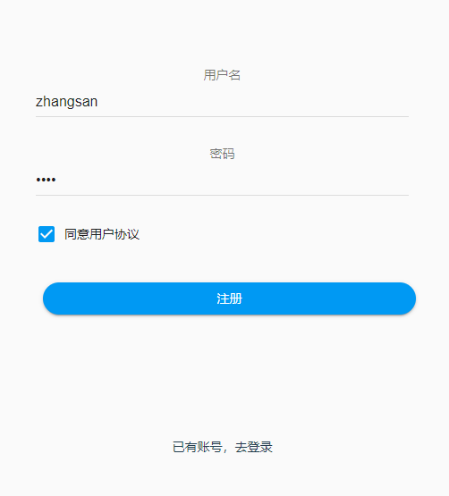
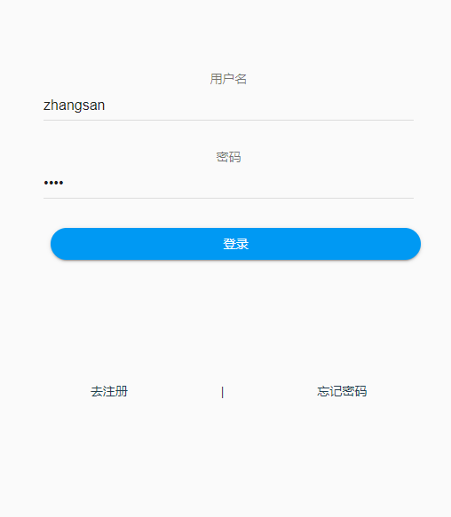
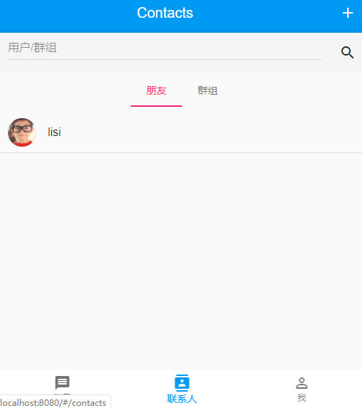
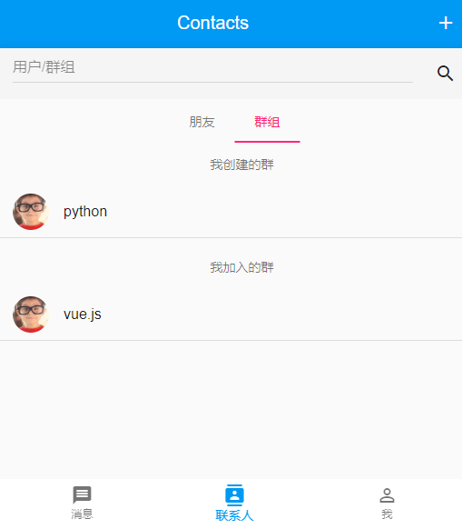
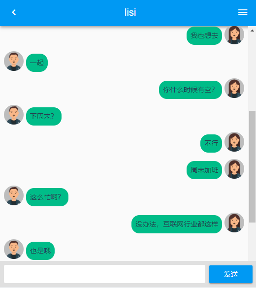

# ichat-frontend

ichat  
是一款基于muse-ui和vue.js的移动端聊天应用，融合了单聊和群聊等功能.  


## 预览

### 注册


### 登录


### 消息


### 好友


### 群组


### 聊天


## 功能

- [x] 注册/登录功能
- [x] 聊天功能
- [x] 查看历史记录
- [x] 群聊
- [x] 单聊
- [x] 好友列表
- [x] 群组列表(我创建的群/我加入的群)
- [x] 加好友
- [x] 创建群
- [x] 加入群

## 依赖包
- vue
- vue-socket.io 
- muse-ui
- vue-router
- vuex
- axios

## 安装
```
$npm install
```

## 运行
```
$npm run serve
或者
$npm run development
```

## 打包
```
npm run build
```

## 配置

### .env.xxx
```
VUE_APP_BASE_API=http://192.168.1.6:5050
NODE_ENV=development
```
VUE_APP_BASE_API 后端API
NODE_ENV 开发模式

### vue.config.js
```
module.exports = {
  devServer: {
    proxy: {
        '/socket.io': {
          target: 'http://192.168.37.120:5050',
          ws: true,
          changeOrigin: true
        },
        'sockjs-node': {
          target: 'http://192.168.37.120:5050',
          ws: false,
          changeOrigin: true
        },
    }

  }
}
```
proxy 为代理配置项，修改target为socket server位置  
vue.config.js配置详情请看[https://cli.vuejs.org/zh/config/#vue-config-js](https://cli.vuejs.org/zh/config/#vue-config-js)


